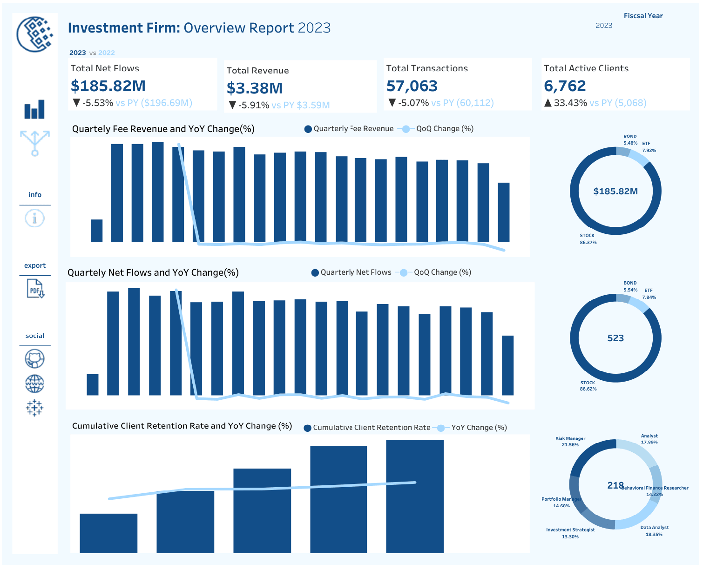
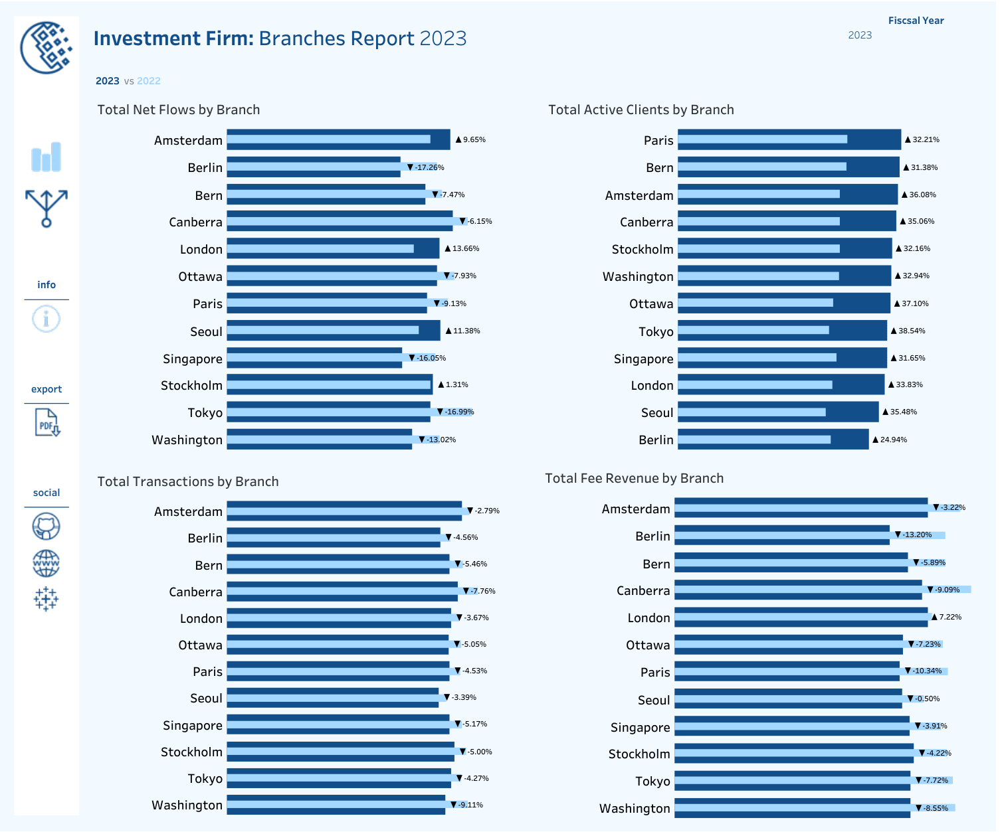

# 📈  Investment Firm Dashboard 

## Info-Data

This dashboard follows up on my data analytics project for as investment firm (You can find the full project [here](https://github.com/theodorosmalezidis/Investment_Firm_Analytics/tree/main)). It offers a clear, data-driven view of the firm’s growth, client loyalty, and operational efficiency.

## Key Takeaways

- The project includes 2 dashboards. The first contains key performance indicators with year-over-year (YoY) changes, tracks quarterly trends in Net Flows and Fee Renenues and highlights cumulative client retention rates. The second provides  a detailed list of all branch performance across key metrics.  
- Increase in Clients with Active Portfolios (YoY).

    Indicates stronger client engagement and interest in investment products despite broader performance metrics.

    May reflect successful onboarding strategies, marketing efforts, or product diversification.
- Decline in Assets Under Management (YoY).

    Despite more active clients, the value of managed assets is falling.

    This may suggest smaller average portfolio sizes, market downturns, or clients withdrawing significant amounts.
- Decrease in Total Transactions (YoY).

    Suggests lower trading activity or reduced interest in rebalancing and investing.

    Could signal caution or dissatisfaction among investors.
- Slight Decline in Client Retention Rate (2020–2022).

    Early decline might reflect the impact of market volatility, competitive pressure, or service-related issues.
- Client Retention Rate Improvement (2022–2024).

    After a dip, retention rates rebounded and stabilized.

    The average retention rate across the full period is 96.08%, which is strong overall and suggests renewed client satisfaction or loyalty.

## Strategic Takeaways

More clients ≠ more value: While client counts rose, the firm is managing less money and seeing fewer transactions.

Focus on portfolio growth: Emphasize upselling and value-based portfolio building to increase AUM per client. Encourage and promote diversification to enhance long-term stability and returns.

Retain and activate: Strengthen retention strategies while encouraging greater engagement from existing clients. Establish a dynamic marketing team that collaborates closely with investment strategists and portfolio managers to drive client activity.

## 📊 Dashboards

🔗 [Tableau Link](https://public.tableau.com/app/profile/theodoros.malezidis7413/viz/InvestmentFirmDashboard/OverviewDashboard)

- Overview Report

- Branches Report

